# open-agentic-platform

[](LICENSE)
[](https://www.rust-lang.org/)
[](specs/)

**The governed operating system for AI-native software delivery.**

> [Getting Started](DEVELOPERS.md) | [Architecture](docs/ARCHITECTURE.md) | [Specs](specs/000-bootstrap-spec-system/spec.md)

---

## What is this

Open Agentic Platform (OAP) closes the gap between local AI tools that feel powerful but become chaotic at scale, and enterprise platforms that promise control but sit too far from the work itself.

It fuses three layers into a single governed system:

- **OPC** (`apps/desktop/`) -- a local Tauri + React cockpit where humans and agents ask, plan, approve, execute, inspect, and rewind work
- **Platform** (`platform/`) -- an organisational control plane for identity, policy, environments, approvals, deployments, and audit
- **Spec Spine** (`specs/`) -- the canonical contract system that turns intent into traceable, machine-verifiable truth

The core belief: the best AI engineering environment is not just fast -- it is fast, governed, reviewable, and replayable.

---

## Architecture

```mermaid
flowchart LR
    subgraph OPC[OPC -- Local Cockpit]
        O1[Local workspaces]
        O2[Desktop UX]
        O3[Git and GitHub context]
        O4[Semantic and structural analysis]
        O5[Snapshots and checkpoints]
        O6[Human + agent collaboration]
    end

    subgraph SPINE[Shared Spec Spine]
        S1[Spec definitions]
        S2[Canonical feature registry]
        S3[Changesets and traceability]
        S4[Approval and policy metadata]
        S5[Compiled governance truth]
    end

    subgraph PLATFORM[Platform -- Organisational Control Plane]
        P1[Identity and access]
        P2[Policy engine]
        P3[Approval centre]
        P4[Deployment orchestration]
        P5[Activity timeline and audit]
        P6[Multi-repo feature graph]
    end

    OPC <--> SPINE
    PLATFORM <--> SPINE
    OPC <--> PLATFORM
```



**OPC** is where work is experienced. **Platform** is where work is governed. **The Spec Spine** is what keeps both sides honest.

---

## Core workflow

1. **Ask** -- a human or agent expresses intent
2. **Plan** -- the system expands intent into specs, plans, tasks, dependencies, and risk boundaries
3. **Approve** -- humans review the proposed work, risk posture, policy checks, and feature impact
4. **Execute** -- agents perform bounded work against governed tools and workspaces
5. **Inspect** -- structure, semantics, git context, runtime state, history, drift, and results are visible in one place
6. **Rewind** -- any work can be compared, restored, replayed, or rolled back with a full trail of state transitions

---

## Spec-first foundation

Human truth is **markdown** (with optional YAML frontmatter); machine registries are **compiler-emitted JSON** only. The bootstrap spec defines the system's own design contract:

- [`000-bootstrap-spec-system`](specs/000-bootstrap-spec-system/spec.md) -- the spec that defines how specs work
- [`001-spec-compiler-mvp`](specs/001-spec-compiler-mvp/spec.md) -- compiles specs to `build/spec-registry/registry.json`
- [`003-feature-lifecycle-mvp`](specs/003-feature-lifecycle-mvp/spec.md) -- status lifecycle (draft / active / superseded / retired)
- [`004-spec-to-execution-bridge-mvp`](specs/004-spec-to-execution-bridge-mvp/spec.md) -- spec to plan to tasks to changeset

---

## Repository structure

```
specs/              -- 103 feature specifications (000-102), the authoritative design record
tools/              -- Rust CLI toolchain
  spec-compiler/    --   compiles specs to build/spec-registry/registry.json
  registry-consumer/--   queries the compiled registry
  spec-lint/        --   conformance linter (W-xxx warnings)
  policy-compiler/  --   compiles governance policies
  codebase-indexer/ --   builds spec-to-code traceability index
crates/             -- Rust library crates
  agent/            --   agent framework: executor, verification, ID generation
  axiomregent/      --   unified MCP agent: GitHub tools, semantic search, checkpoint
  factory-engine/   --   two-phase pipeline engine
  factory-contracts/--   Rust types for Factory contract schemas
  orchestrator/     --   multi-agent workflow dispatch, DAG validation, state persistence
  policy-kernel/    --   5-tier settings merge, proof chains, policy evaluation
  tool-registry/    --   ToolDef trait + registry with permission gates
  xray/             --   repository analysis: complexity scoring, call graphs, fingerprinting
factory/            -- Factory delivery engine
  contract/         --   formal schemas: Build Spec, Adapter Manifest, Pipeline State
  process/          --   7-stage pipeline: agents and stage definitions
  adapters/         --   pluggable tech adapters (aim-vue-node, next-prisma, encore-react, rust-axum)
apps/desktop/       -- Tauri v2 + React desktop app (TypeScript + Rust)
platform/           -- Organisational control plane
  services/
    stagecraft/     --   Encore.ts SaaS (auth, admin, monitoring, Slack, GitHub webhooks)
    deployd-api-rs/ --   Rust (axum + hiqlite) K8s deployment orchestration
  infra/            --   Terraform modules (Azure AKS, ACR, KeyVault)
  charts/           --   Helm charts (stagecraft, deployd-api, rauthy)
build/              -- Compiler output (registry.json, index.json, build-meta.json)
.claude/            -- Claude Code agents, commands, and rules
```

---

## Getting started

```bash
# Compile specs and query the registry
cargo build --release --manifest-path tools/spec-compiler/Cargo.toml
./tools/spec-compiler/target/release/spec-compiler compile
./tools/registry-consumer/target/release/registry-consumer list

# Lint specs for conformance
cargo build --release --manifest-path tools/spec-lint/Cargo.toml

# Build the codebase index (spec-to-code traceability)
cargo build --release --manifest-path tools/codebase-indexer/Cargo.toml
./tools/codebase-indexer/target/release/codebase-indexer compile

# Platform services (local dev)
cd platform/services/stagecraft && npm run start   # Encore.ts on :4000

# deployd-api (Rust)
cargo build --release --manifest-path platform/services/deployd-api-rs/Cargo.toml
```

See [DEVELOPERS.md](DEVELOPERS.md) for the full setup guide.

---

## Factory delivery engine

The Factory (`factory/`, `crates/factory-engine/`, `crates/factory-contracts/`) is a two-phase AI pipeline that transforms business requirements into production code:

1. **Phase 1** (s0--s5): six sequential stages extract requirements, design services, model data, specify APIs and UI, producing a frozen Build Spec
2. **Phase 2** (s6a--s6g): dynamic scaffold fan-out generates code per-entity, per-operation, per-page with post-step verification

Four pluggable adapters: `aim-vue-node`, `next-prisma`, `rust-axum`, `encore-react`.

```bash
cargo run --manifest-path crates/factory-engine/Cargo.toml --bin factory-run -- \
  --adapter next-prisma --project /tmp/my-app \
  --business-docs requirements.md
```

---

## Claude-native development

This repository ships with first-class [Claude Code](https://docs.anthropic.com/en/docs/claude-code) integration. The `.claude/` directory contains development infrastructure that contributors can use immediately:

- **Agents** (`.claude/agents/`) -- architect, explorer, implementer, reviewer, encore-expert
- **Commands** (`.claude/commands/`) -- `/init`, `/commit`, `/code-review`, `/validate-and-fix`, `/research`, `/implement-plan`, `/cleanup`, `/factory-sync`
- **Rules** (`.claude/rules/`) -- orchestrator behavioral rules enforcing step ordering, file-based artifact passing, and checkpoint discipline

Combined with `CLAUDE.md` (project conventions) and `AGENTS.md` (agent protocol), every contributor gets AI-assisted development workflows out of the box.
This encapsulate how the platform was built.

---

## Who this is for

- Engineers who want deep local agency with AI without losing operational discipline
- Platform teams who need standards, control, and auditability
- Organisations adopting agentic workflows in serious production settings
- Product and infrastructure groups working across multiple repositories and environments

---

## Contributing and governance

- [Contributing Guide](CONTRIBUTING.md) -- how to get started, branch conventions, and PR process
- [Code of Conduct](CODE_OF_CONDUCT.md) -- community standards (Contributor Covenant v2.1)
- [Security Policy](SECURITY.md) -- reporting vulnerabilities
- [License](LICENSE) -- AGPL-3.0
