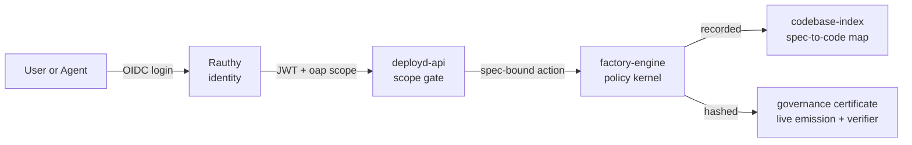

```mermaid
flowchart LR
    subgraph OPC[OPC -- Local Cockpit]
        O1[Local workspaces]
        O2[Desktop UX]
        O3[Git and GitHub context]
        O4[Semantic and structural analysis]
        O5[Snapshots and checkpoints]
        O6[Human + agent collaboration]
    end

    subgraph SPINE[Shared Spec Spine]
        S1[Spec definitions]
        S2[Canonical feature registry]
        S3[Changesets and traceability]
        S4[Approval and policy metadata]
        S5[Compiled governance truth]
    end

    subgraph PLATFORM[Platform -- Organisational Control Plane]
        P1[Identity and access]
        P2[Policy engine]
        P3[Approval centre]
        P4[Deployment orchestration]
        P5[Activity timeline and audit]
        P6[Multi-repo feature graph]
    end

    OPC <--> SPINE
    PLATFORM <--> SPINE
    OPC <--> PLATFORM
```

# open-agentic-platform

[](LICENSE)
[](specs/)
[](#)
[](#status)

**Frozen, hash-verifiable specs as the unit of governance for agent
execution.** Every change is bound to a spec; every spec compiles to a
deterministic JSON registry; every agent action is reconcilable to the spec
that authorised it — and the audit chain is a single artifact you can hand
to a regulator.

- **Spec spine** — 142 markdown specs compile to a deterministic
  `registry.json`. Drift between spec and code fails CI before merge
  ([spec 127](specs/127-spec-code-coupling-gate/spec.md)).
- **Governed agent execution** — agents act through scoped tools, policy
  gates, and permission tiers. SHA-256 proof chains and JSONL audit logs
  are the runtime substrate, not bolt-on observability. Every factory
  run emits a self-authenticating `governance-certificate.json`
  ([spec 102](specs/102-governed-excellence/spec.md)) that an auditor
  can verify independently — `make verify-certificate FILE=...` exits
  non-zero on tamper with a specific artifact-hash diagnostic.
- **Identity-bounded collaboration** — Rauthy issues OIDC tokens, deployd-api
  enforces scope at every request, the spec spine defines what each scope
  is allowed to authorise.

**Same discipline, applied to ourselves.** Every release ships per-target
CycloneDX SBOMs (`sbom-desktop-aarch64-apple-darwin.cdx.json`,
`sbom-desktop-x86_64-pc-windows-msvc.cdx.json`,
`sbom-desktop-x86_64-unknown-linux-gnu.cdx.json`, `sbom-tools.cdx.json`)
and an aggregate `open-agentic-platform-release.cyclonedx.json`, alongside
SHA256-verifiable installers. The provenance discipline applied to
governed agent execution is the discipline applied to the project's own
releases.

**Try it now:** [install a prebuilt cockpit ↓](#install) or [reproduce
the OWASP ASI 2026 traceability artifact from source ↓](#try-it).

> Licensed **AGPL-3.0**. Strong copyleft is deliberate: the audit chain
> is a public good for regulated buyers, and AGPL prevents that work from
> being absorbed into proprietary control planes that strip the
> traceability while keeping the engine.

---

## What this is

OAP is a governed control plane for AI-native software delivery, built
around three concrete components that already exist in this tree:

The **spec spine** (`specs/`) is the authoritative design record. Every
feature is a markdown file with YAML frontmatter, compiled by
[`spec-compiler`](tools/spec-compiler/) into a deterministic `registry.json`.
Specs are read through the consumer binary
[`registry-consumer`](tools/registry-consumer/) — never by ad-hoc parsing —
which makes the spec corpus a typed, query-able surface
([spec 103](specs/103-init-protocol-governed-reads/spec.md)).

The **platform layer** (`platform/`) is the organisational control plane:
[Rauthy](platform/charts/rauthy/) for OIDC identity,
[`deployd-api-rs`](platform/services/deployd-api-rs/) for scope-gated
deployment orchestration, [Encore.ts stagecraft](platform/services/stagecraft/)
for governance UX, and Helm charts for managed-K8s deployment.

The **OPC desktop** (`apps/desktop/`) is a Tauri v2 + React cockpit where
humans and agents share a single execution surface — local workspaces, git
context, semantic and structural analysis, snapshots, approval gates.

## Who this is for

- **OWASP ASI 2026 practitioners** evaluating governed agent runtimes. The
  compliance-report CLI emits a real ASI-control-to-spec mapping today.
- **Regulated-industry security and compliance teams** who need a single
  audit chain artifact rather than a stitched-together evidence pack.
- **Government-of-Canada and provincial buyers** with Azure-heavy estates,
  uneven GCP, corner-case AWS, and sovereignty constraints that rule out
  closed control planes.
- **Engineering platform teams** building internal AI delivery pipelines
  where governance must be the execution model, not a sidecar.

## How it works

### Architectural layers



OPC is where work is experienced. Platform is where work is governed. The
spec spine keeps both sides honest.

### Trust fabric — one continuous path



You operate every node in the path. There is no SaaS in the trust path
unless you put it there.

## Adapters

The factory engine generates code through pluggable adapters that
implement a shared contract.

- **`aim-vue-node`** — production-supported. The active scaffold target;
  recent specs ([138](specs/138-stagecraft-create-realised-scaffold/spec.md),
  [140](specs/140-aim-vue-node-scaffold-source-id-cutover/spec.md),
  [141](specs/141-aim-vue-node-source-id-template-name-alignment/spec.md))
  drive its hardening. Used end-to-end by the tenant onboarding path.
- **`next-prisma`**, **`rust-axum`**, **`encore-react`** — factory-contract
  validated. Each registers against the same adapter manifest contract
  the production adapter implements; their scaffolds exist but are not
  the current production target. Treat as parity validators for the
  contract, not drop-in alternatives.

## License (and why AGPL)

OAP is licensed under the [GNU Affero General Public License v3.0](LICENSE).
Strong copyleft is the strategic choice. The intended beneficiary is the
public — regulated buyers who depend on a governance layer cannot afford
to have the audit chain absorbed into a proprietary control plane that
serves the audit chain back as a paid feature. AGPL closes the network
loophole that would let a hosted offering capture the value while
stripping the traceability commitments the spec spine encodes. If you are
building a closed product on top, this is the wrong substrate; if you are
building an internal governed platform or a public good that hardens
others' governance, it is the right one.

## Install

Prebuilt OPC desktop installers ship with each
[release](https://github.com/stagecraft-ing/open-agentic-platform/releases):

- **macOS (Apple Silicon)** — `opc_<version>_aarch64.dmg`
- **Windows** — `opc_<version>_x64-setup.exe` (NSIS) or
  `opc_<version>_x64_en-US.msi`
- **Linux** — `opc_<version>_amd64.AppImage`, `opc_<version>_amd64.deb`,
  or `opc-<version>-1.x86_64.rpm`

Verify before installing — every installer ships an `.sha256` sidecar:

```bash
sha256sum -c opc_0.3.2_aarch64.dmg.sha256
```

Per-target CycloneDX SBOMs (`sbom-desktop-<triple>.cdx.json`) and the
aggregate `open-agentic-platform-release.cyclonedx.json` are release
assets — verify the bill of materials before the binary runs in your
environment. The `oap-tools-<triple>.tar.gz` archive ships the spec
toolchain (`registry-consumer`, `spec-compiler`, `codebase-indexer`) for
the quickstart below without a Rust toolchain.

## Try it

These commands work from a fresh clone today and produce real artifacts.
The OWASP ASI 2026 traceability mapping is a single deterministic JSON
file; the spec/code coupling and codebase index are governed reads
through compiled consumer binaries.

```bash
make setup
# Builds spec compiler + codebase indexer, compiles the registry,
# fetches the axiomregent sidecar binary.

./tools/registry-consumer/target/release/registry-consumer \
    compliance-report --framework owasp-asi-2026 --json
# Emits the ASI-control-to-spec mapping. This is the traceability
# artifact: structured, deterministic, and reproducible from the
# compiled registry.

./tools/registry-consumer/target/release/registry-consumer \
    status-report --json --nonzero-only
# Lifecycle inventory across the 142-spec corpus.
# 137 approved, 1 draft, 4 superseded.

./tools/codebase-indexer/target/release/codebase-indexer render
cat build/codebase-index/CODEBASE-INDEX.md
# Renders the spec-to-code map. The 'Spec' column is the
# traceability surface for every Rust crate and npm package.

# Governance certificate — the load-bearing artifact (spec 102).
# `make build-certificate` reads any factory run directory and writes a
# self-authenticating governance-certificate.json binding requirements
# hash, frozen Build Spec hash, per-stage artifact hashes, and the
# certificate's own SHA-256 into one auditable JSON file. To make the
# Try it block fresh-clone reproducible, we synthesise a one-stage run
# directory with a single artifact:
mkdir -p /tmp/oap-demo-run/s0-preflight
echo '{"ok":true}' > /tmp/oap-demo-run/s0-preflight/preflight.json
echo "tenant onboarding requirements" > /tmp/oap-demo-reqs.md

make build-certificate FILE=/tmp/oap-demo-run \
    BUSINESS_DOCS=/tmp/oap-demo-reqs.md \
    ADAPTER=aim-vue-node
# governance certificate written: /tmp/oap-demo-run/governance-certificate.json
#   (status=Complete, stages=6, hash=<16-char prefix>)

make verify-certificate FILE=/tmp/oap-demo-run/governance-certificate.json \
    ARTIFACT_DIR=/tmp/oap-demo-run
# governance certificate VERIFIED  (exit 0)

# Tamper an artifact and verify again — the cert rejects with a
# specific diagnostic, exit 1:
echo "TAMPERED" > /tmp/oap-demo-run/s0-preflight/preflight.json
make verify-certificate FILE=/tmp/oap-demo-run/governance-certificate.json \
    ARTIFACT_DIR=/tmp/oap-demo-run
# governance certificate INVALID (1 error(s)):
#   - artifact hash mismatch: s0-preflight/preflight.json:
#     expected <hash-A>, got <hash-B>
# The verifier does not trust the system that produced the certificate.
```

`factory-run` itself emits `governance-certificate.json` automatically at
the end of every pipeline run (success or halt) under
`<project>/.factory/runs/<run-id>/`. The two `make` targets above cover
retroactive certification and the auditor's independent verify path,
which is what makes the certificate trustworthy.

For the full daily-development loop:

```bash
make ci          # ~5 min warm — the daily dev loop (spec 135)
make ci-strict   # ~90 min — full parity mirror, pre-merge / parity-investigation
make dev         # OPC desktop (Vite + Tauri, hot-reload)
```

## Status

OAP is **pre-alpha, stealth, single-developer**. No public releases. No
external contributors yet. The status section below records what works
today vs. what is staged and what is roadmap, by spec ID.

### Works today

- **Spec compilation and querying** — 142 specs compile deterministically.
  `registry-consumer` is a typed read-only CLI; ad-hoc JSON parsing is a
  workflow violation ([spec 103](specs/103-init-protocol-governed-reads/spec.md)).
- **Spec/code coupling gate** — every code path claimed by a spec's
  `implements:` list must change with the spec
  ([spec 127](specs/127-spec-code-coupling-gate/spec.md)).
- **Codebase index** — spec-to-code traceability for every crate and
  package ([spec 101](specs/101-codebase-index-mvp/spec.md)).
- **OWASP ASI 2026 compliance map** — six controls (ASI01, 03, 05, 07,
  09, 10) map to spec 102 today via `registry-consumer compliance-report`.
- **Governance certificate — live emission** ([spec 102](specs/102-governed-excellence/spec.md))
  — every `factory-run` writes `governance-certificate.json` under the
  run directory at termination (success or halt), binding requirements
  hash, frozen Build Spec hash, per-stage artifact hashes, and a
  self-authenticating SHA-256 over the canonical JSON. `make
  verify-certificate FILE=...` is the auditor's independent verifier:
  exit 0 on a clean cert, exit 1 with a specific artifact-hash-mismatch
  diagnostic on tamper. `make build-certificate FILE=...` covers the
  retroactive-certification flow. The companion sister binary
  `verify-certificate` does not trust the system that produced the
  certificate (FR-007).
- **Identity (Rauthy)** — production-grade OIDC chart with HA
  ([spec 106](specs/106-rauthy-native-oidc-and-membership/spec.md)).
- **Scope-gated deployment** — `deployd-api-rs` enforces
  `DEPLOYD_REQUIRED_SCOPE` on every request against Rauthy-issued JWTs.
- **Supply chain gates** — `cargo-deny` + `pnpm audit` + `npm audit`,
  blocking from day 0 ([spec 116](specs/116-supply-chain-policy-gates/spec.md)).
- **Schema parity walker** — Rust ↔ TypeScript contract drift fails CI
  ([spec 125](specs/125-schema-parity-walker-rebuild/spec.md)).
- **Azure AKS deployment** — `make deploy-azure` against
  `platform/infra/terraform/envs/dev/`.
- **Hetzner K3s deployment** — `make deploy-hetzner` via standalone Helm
  bootstrap path.

### Experimental / partially wired

- **Governance certificate — schema fixtures and SSE emission**
  ([spec 102](specs/102-governed-excellence/spec.md) FR-002, FR-010) —
  pipeline emission is wired and the verifier round-trip is part of CI,
  but a few targets in spec 102 remain open: the explicit JSON Schema
  artifact at `factory/contract/schemas/governance-certificate.schema.json`
  (FR-002) is not yet committed (the Rust `serde` types are the de-facto
  schema), and the `governance-certificate-generated` SSE event over
  `LocalEventNotifier` (FR-010) is not yet plumbed. Phases B/C/D of spec
  102 (policy-bridge composition, traceability unification, OWASP
  hardening) remain partially wired against the per-FR success criteria.
- **Factory pipeline** — two-phase engine (s0–s5 sequential, s6a–s6g
  fan-out) with four registered adapters; aim-vue-node is the production
  scaffold target.
- **AWS / GCP / DigitalOcean Terraform modules**
  ([spec 072](specs/072-multi-cloud-k8s-portability/spec.md)) — modules
  exist in `platform/infra/terraform/modules/` but no environment
  directories instantiate them yet. Helm charts and Rauthy/deployd-api
  are cloud-neutral.

### Roadmap

- **Tenant environment access gates**
  ([spec 137](specs/137-tenant-environment-access-gates/spec.md), draft) —
  binds Rauthy-issued scopes to tenant-environment-scoped policy-kernel
  permissions. Planning artifacts (`plan.md`, `tasks.md`) landed
  2026-05-04; implementation is next.
- **End-to-end pipeline → certificate emission** — closure of spec 102.
- **AWS / GCP / DigitalOcean environments** — instantiating
  `envs/aws-dev/`, `envs/gcp-dev/`, `envs/do-dev/` against the existing
  Terraform modules.

## Layout

| Path | What lives there |
|---|---|
| `specs/` | The authoritative spec spine. 142 specs as of 2026-05-06. |
| `tools/` | Rust CLIs: `spec-compiler`, `registry-consumer`, `spec-lint`, `codebase-indexer`, `policy-compiler`, `spec-code-coupling-check`, others. |
| `crates/` | Library crates: `factory-engine`, `factory-contracts`, `policy-kernel`, `orchestrator`, `agent`, `tool-registry`, `axiomregent`, `xray`, others. |
| `apps/desktop/` | OPC desktop (Tauri v2 + React + TypeScript). |
| `platform/` | Identity, deployd-api, stagecraft, Helm charts, Terraform infra. |
| `build/` | Compiler-emitted machine truth: `spec-registry/`, `codebase-index/`. Read through consumer binaries only. |
| `.claude/` | Agent and command definitions used by the development environment. See `CLAUDE.md` and `AGENTS.md`. |

Full setup, prerequisites, and platform-service development:
[`DEVELOPERS.md`](DEVELOPERS.md). Repository conventions and architectural
rules: [`CLAUDE.md`](CLAUDE.md). Compiler architecture and registry
contract: [`docs/ARCHITECTURE.md`](docs/ARCHITECTURE.md).
