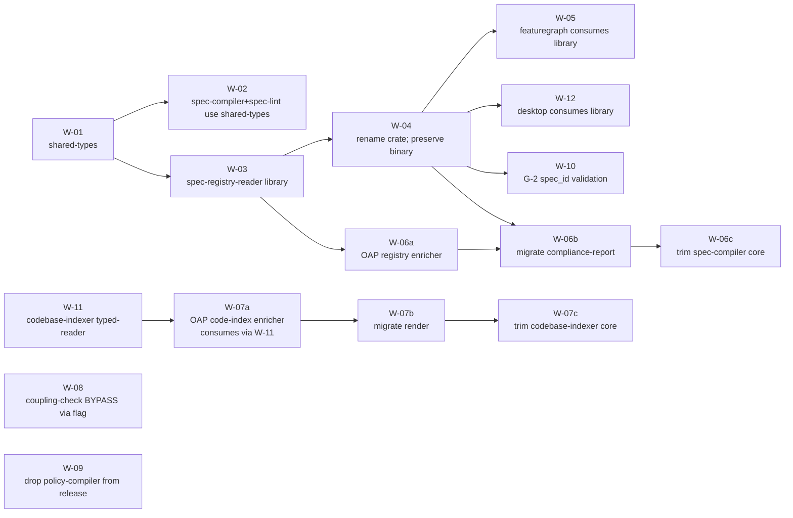

# Spec-Spine Cut D — Execution Map

> Read-only execution plan. Companion to
> `docs/analysis/spec-spine-footprint.md` — Phase 2 of that report is
> the input set for Phase 1 here. Cut D operates **in-place inside
> OAP**: no repo split, no calendar pressure, every intermediate state
> must leave OAP buildable. Sequence confirmed; W-11
> (codebase-indexer typed-reader, mirror of W-03) added with W-07a
> updated to consume through it.

---

## Executive summary

1. **16 work units** resolve every leak and hidden leak in the
   footprint report. Three are large (>2 k LoC), four medium, the
   remainder small or trivial. Total estimated diff: ~8–10 k LoC delta.
2. The `spec-compiler` enrichments (`factoryProjects`, `compliance`,
   `adapter`) come out as a **post-processor**, not a trait-based
   plugin. Trait dispatch would force runtime registration in a binary
   that ships under `release-tools.yml` — strictly worse for the
   release contract and for spec 103 governed-read semantics.
3. The codebase-indexer split is symmetric to the spec-compiler
   split: generic indexer emits `index.json` (Layers 1–2), OAP-side
   enricher consumes the generic index + walks `factory/`, `.claude/`,
   `.github/workflows/` and writes `index-oap.json` +
   `CODEBASE-INDEX.md`.
4. Both `registry-consumer` and `codebase-indexer` are restructured
   **in place** to expose typed-reader library APIs alongside their
   binaries (W-03 and W-11 respectively). No new "reader" crates;
   binary names preserved for release-artifact compatibility.
5. `frontmatter` is absorbed into the shared-types crate. A 40-LoC
   utility doesn't deserve its own crate once shared-types exists.
6. The shared-types crate is a hard leaf: depends only on `serde` /
   `serde_yaml`. It owns `SHAPE_TABLE`, `KNOWN_KEYS`, `VALID_KINDS`,
   `VALID_RISK_LEVELS`, `CONVENTIONAL_CATEGORIES`, the V-xxx code
   registry, and the W-xxx code registry.
7. **Critical path is 5 PRs:** W-01 → W-03 → W-06a → W-06b → W-06c.
   After W-06c lands, the `registry.json` schema is finally generic.
8. `featuregraph` stays in OAP as a typed-reader *consumer*, not a
   spec-spine crate. Its `CompiledRegistry` duplicate disappears in
   W-05.
9. The G-2 spec_id validation (W-10) is a small focused PR with no
   sequencing gate other than W-03/W-04. Warn-by-default; env-gated
   to error.
10. **No release-freeze windows.** Three PRs (W-06b, W-07b, W-09)
    introduce CLI-archive breaks that need release-notes callouts but
    none requires holding releases.

**Confidence per phase**

| Phase | Confidence | What would raise it |
|-------|------------|---------------------|
| 1. Work-unit inventory | High | — |
| 2. Crate-level surgery design | High | — |
| 3. Sequencing | High | — |
| 4. Intermediate-state checkpoints | High | A trial PR running W-01 would confirm "no release-freeze" assertion. |
| 5. End-state design | High | — |
| 6. G-2 plug-in | Medium | The exact line numbers in the hook site depend on whether W-10 lands before or after any other spec 102 phase-B/C/D work in flight. |
| 7. Open questions | Stubbed | These are user calls; "raising confidence" doesn't apply. |

---

## Phase 1 — Work-unit inventory

Conventions:
- **Resolution class:** lift / invert / trait-ify / dedupe / delete / new-crate.
- **Diff size:** trivial <100, small <500, medium <2000, large >2000.
- **API impact:** none (internal-only), additive (new surface, no
  removals), breaking (changes shape or removes API/CLI/JSON field).

### Shared-types (new crate)

| ID | Title | Source | Class | Crates touched | API impact | Diff | Risk |
|----|-------|--------|-------|----------------|------------|------|------|
| **W-01** | Create shared-types crate; absorb `frontmatter` | Phase 2 hidden-leak: SHAPE_TABLE duplication (`spec-compiler/src/lib.rs:115` vs `spec-lint/src/lib.rs:46`); plus `spec-compiler/src/lib.rs:46-83, 86, 91-108`. | new-crate (+ delete `tools/shared/frontmatter/`) | write: `tools/shared/spec-types/`; delete: `tools/shared/frontmatter/`; update every consumer's Cargo.toml dep name | additive | small (~400 LoC) | Two SHAPE_TABLE copies must be byte-identical post-hoist; covered by shared-types assertion test. |

### spec-compiler

| ID | Title | Source | Class | API | Diff | Risk |
|----|-------|--------|-------|-----|------|------|
| **W-02** | Replace local `SHAPE_TABLE` + V-xxx constants with shared-types imports | `spec-compiler/src/lib.rs:46-83, 86, 91-132` | dedupe | none | small (~250 LoC) | Golden tests catch any drift. |
| **W-06c** | Remove `factoryProjects` / `compliance` / `adapter` from compiler core | `spec-compiler/src/lib.rs:796-803, 999-1000, 1212-1340, 1390-1416`; drop `"compliance"` from `KNOWN_KEYS:46-83` | lift (out → OAP enricher) | **breaking** (registry.json schema removes top-level + per-feature fields) | medium (~700 LoC delta; 213-LoC test moves) | Cannot land before W-06b. |

### spec-lint

| ID | Title | Source | Class | API | Diff | Risk |
|----|-------|--------|-------|-----|------|------|
| W-02 (shared) | Replace local `SHAPE_TABLE`, `CONVENTIONAL_CATEGORIES`, W-xxx constants | `spec-lint/src/lib.rs:23-63` | dedupe | none | (rolled into W-02) | `--fail-on-warn` semantics unchanged. |

### registry-consumer → spec-registry-reader

| ID | Title | Source | Class | API | Diff | Risk |
|----|-------|--------|-------|-----|------|------|
| **W-03** | Add typed-reader library API to crate | `registry-consumer/src/lib.rs:7-225`; Phase 2 Surprise #3 (featuregraph's ad-hoc parse) | new-crate (in-place restructure) | additive | medium (~1500 LoC including tests) | Schema-version dispatch design — see Phase 2. |
| **W-04** | Rename crate identifier; preserve binary name `registry-consumer` | (consequence of W-03) | new-crate (rename) | additive externally; breaking internally | small (~300 LoC) | Release-tools.yml manifest path edit; CI 10× test-subset loop updates. |
| **W-06b** | Move `compliance-report` subcommand from `registry-consumer` to OAP enricher | `registry-consumer/src/main.rs:69-225` | invert | breaking (CLI path) | small (~300 LoC) | README/CLAUDE.md/AGENTS.md scan for invocations. |

### featuregraph

| ID | Title | Source | Class | API | Diff | Risk |
|----|-------|--------|-------|-----|------|------|
| **W-05** | Replace `CompiledRegistry` duplicate with typed-reader consumption | `crates/featuregraph/src/registry_source.rs:14-79` | dedupe | additive (internal) | small (~250 LoC) | `impl_files()` semantics byte-preserved; covered by golden tests. |

### codebase-indexer

| ID | Title | Source | Class | API | Diff | Risk |
|----|-------|--------|-------|-----|------|------|
| **W-11** (NEW) | Add typed-reader library API to codebase-indexer crate (mirror of W-03) | Symmetric to W-03; consumer base = spec-code-coupling-check (`tools/spec-code-coupling-check/src/lib.rs:9, 165`) + future W-07a | new-crate (in-place restructure) | additive | small-medium (~700 LoC including tests) | Smaller than W-03 because types are already serde-friendly and only one schema version exists today (1.4.0 → 2.0.0 in W-07c). spec-code-coupling-check migrates from raw `serde_json::from_str` to the new `load` in the same PR (validates the API has a real consumer). |
| **W-07b** | Move `render.rs` to OAP enricher; Makefile/CI invoke enricher for `CODEBASE-INDEX.md` | `tools/codebase-indexer/src/render.rs` (342 LoC), `lib.rs:356`, `main.rs` render subcommand | lift | additive (new enricher subcommand) / breaking (`codebase-indexer render` gone) | small (~500 LoC moved) | Touches AGENTS.md init protocol (line 14 references `codebase-indexer render`). |
| **W-07c** | Trim factory.rs, infra.rs, workflows.rs + Layer 3–5 types; bump SCHEMA_VERSION 1.4.0 → 2.0.0 | `tools/codebase-indexer/src/{factory,infra,workflows}.rs`; `types.rs` AdapterRecord, Infrastructure, WorkflowTrace; `schemas/codebase-index.schema.json` | lift | **breaking** (schema) | medium (~1200 LoC removed) | Cannot land before W-07b. spec-code-coupling-check uses only Layer 2 fields — verify schema bump still passes. |

### OAP registry enricher (new crate)

| ID | Title | Source | Class | API | Diff | Risk |
|----|-------|--------|-------|-----|------|------|
| **W-06a** | New `oap-registry-enrich` binary: reads `registry.json` via spec-registry-reader + walks `specs/*/spec.md` + `.factory/build-spec.yaml`; emits `registry-oap.json` | (target for W-06c lift) | new-crate | additive | medium (~1000 LoC) | NOT added to `release-tools.yml`. |

### OAP code-index enricher (new crate)

| ID | Title | Source | Class | API | Diff | Risk |
|----|-------|--------|-------|-----|------|------|
| **W-07a** (updated) | New `oap-code-index-enrich` binary: **consumes generic index via the W-11 typed-reader**; walks `factory/adapters/`, `.claude/{agents,commands,rules,schemas}/`, `.github/workflows/`; emits `index-oap.json` | (target for W-07c lift) | new-crate | additive | medium (~1500 LoC including the lifted scanners) | NOT added to `release-tools.yml`. Gates on W-11 (was: gated on nothing). |

### spec-code-coupling-check

| ID | Title | Source | Class | API | Diff | Risk |
|----|-------|--------|-------|-----|------|------|
| **W-08** | Externalize `BYPASS_PREFIXES` via CLI flag / config file | `tools/spec-code-coupling-check/src/lib.rs:23-34` | invert | additive (new flag) | small (~200 LoC) | Default value: empty list (fail-closed). |

### factory-engine (G-2)

| ID | Title | Source | Class | API | Diff | Risk |
|----|-------|--------|-------|-----|------|------|
| **W-10** | Validate `StageRecord.spec_id` resolves against registry via spec-registry-reader | `crates/factory-engine/src/governance_certificate.rs:129, 519, 723, 747, 793, 846, 876, 920` | lift (new hook) | additive (no cert-format change) | small (~150 LoC) | Detail in Phase 6. |

### apps/desktop

| ID | Title | Source | Class | API | Diff | Risk |
|----|-------|--------|-------|-----|------|------|
| **W-12** | Replace raw `registry.json` read with typed-reader call | `apps/desktop/src-tauri/src/commands/analysis.rs:28, 342, 372` | dedupe | none externally | small (~100 LoC) | Tauri tests re-keyed. |

### release-tools workflow

| ID | Title | Source | Class | API | Diff | Risk |
|----|-------|--------|-------|-----|------|------|
| **W-09** | Drop `policy-compiler` from release bundle | `.github/workflows/release-tools.yml:116-117, 139` | delete (from bundle) | **breaking** for external policy-compiler binary consumers | trivial (~30 LoC) | policy-compiler still builds in `spec-conformance.yml`. |

### Summary

| Crate | Work-unit count | Est. diff |
|-------|-----------------|-----------|
| `tools/shared/spec-types/` (new) | 1 (W-01) | small |
| `tools/spec-compiler/` | 2 (W-02 share, W-06c) | medium |
| `tools/spec-lint/` | 1 (W-02 share) | small |
| `tools/registry-consumer/` (renamed) | 3 (W-03, W-04, W-06b) | medium |
| `crates/featuregraph/` | 1 (W-05) | small |
| `tools/codebase-indexer/` | **3** (W-11, W-07b, W-07c) | medium |
| `tools/oap-registry-enrich/` (new) | 1 (W-06a) | medium |
| `tools/oap-code-index-enrich/` (new) | 1 (W-07a) | medium |
| `tools/spec-code-coupling-check/` | 1 (W-08) | small |
| `crates/factory-engine/` | 1 (W-10) | small |
| `apps/desktop/src-tauri/` | 1 (W-12) | small |
| `.github/workflows/release-tools.yml` | 1 (W-09) | trivial |
| **Totals** | **16 work units** | **~8–10 k LoC delta** |

---

## Phase 2 — Crate-level surgery design

### spec-compiler (post-surgery)

**Stays:** generic validation (V-001..V-019), generic feature record
emission, schema versioning (`SPEC_VERSION` 1.5.0 → 2.0.0 in W-06c
because the field-removal is a breaking schema change).

**Moves out (to OAP registry enricher):** factoryProjects discovery
+ emission, parse_compliance, parse_factory_project's adapter
discovery. Test `factory_projects.rs` (213 LoC) moves with the code.

**Mechanism: post-processor.** Defended above; not repeated.

**Public API (post-W-06c):** unchanged except registry JSON shape.

**build-meta.json provenance:** unchanged; OAP enricher emits
`build-meta-oap.json` recording the generic `registry.json` hash as
its input.

### codebase-indexer (generic, post-surgery)

**Stays:** manifest.rs, spec_scanner.rs, comment_scanner.rs, xref.rs,
hash.rs, schema.rs (trimmed), types.rs (Layer 1+2 only), lib.rs
(compile/check/dump_inputs), **and the new typed-reader API from
W-11** (load, IndexReaderError, schema-version dispatch).

**Moves out (W-07a/b/c):** factory.rs, infra.rs, workflows.rs,
render.rs. Layer 3–5 types (AdapterRecord, Infrastructure,
WorkflowTrace).

**Crate API after W-11 + W-07c:**
```text
// Producer side (existing, trimmed)
pub fn compile(repo_root: &Path) -> Result<CompileOutput, IndexError>;
pub fn compile_and_write(repo_root: &Path) -> Result<CompileOutput, IndexError>;
pub fn check(repo_root: &Path) -> Result<(), IndexError>;
pub fn dump_inputs(repo_root: &Path) -> Result<(), IndexError>;

// Reader side (NEW, W-11)
pub fn load(path: &Path) -> Result<CodebaseIndex, IndexReaderError>;
pub fn load_with_schema_check(path: &Path) -> Result<CodebaseIndex, IndexReaderError>;
pub enum IndexReaderError { Io, Json, UnknownSchemaVersion(String) }

// Types (existing, trimmed)
pub mod types {
    pub const SCHEMA_VERSION: &str = "2.0.0";
    pub struct CodebaseIndex { … }   // only Layers 1+2
    pub struct PackageRecord { … }
    pub struct Traceability { … }
    pub struct TraceMapping { … }
    pub struct ImplementingPath { … }
    pub enum TraceSource { … }
    pub struct Diagnostics { … }
    pub struct Diagnostic { … }
}
```

**Schema lives in:** `schemas/codebase-index.schema.json` (trimmed to
v2.0.0); adjacent `schemas/codebase-index-oap.schema.json` (new)
describes the enriched superset.

### W-11 typed-reader design (mirror of W-03)

Same in-place-restructure choice as W-03:
- Single crate (codebase-indexer) hosts both producer and reader.
- Binary name `codebase-indexer` preserved.
- Schema-version dispatch lives in a `schema_v2_0` module (or one
  module per supported version); top-level `load` peeks at
  `schemaVersion` and dispatches.
- `IndexReaderError` enum replaces ad-hoc string errors.

**Difference from W-03 (smaller surface):**
- Only one schema version exists in this generation (2.0.0 after
  W-07c); the dispatch is a single-arm match today but the structure
  exists for forward-compat.
- The crate's existing `types::CodebaseIndex` is already
  serde-friendly; W-11 mostly adds the load entry points + error
  type + version dispatch.
- spec-code-coupling-check is the **immediate consumer** in the same
  PR — it migrates from `serde_json::from_str` at
  `tools/spec-code-coupling-check/src/lib.rs:165` to
  `codebase_indexer::load`. This is the W-11 equivalent of "W-05
  validates W-03"; co-landing the consumer validates the API.

**Why a typed-reader at all** (since the crate already exposes types
as `pub`): contractual symmetry with the registry side. After Cut D
both compiled artifacts (`registry.json`, `index.json`) are read via
the same pattern — a `load(path) -> Result<TypedShape, Error>` call
from a single crate that also produces the artifact. spec 103's
"consumer binary exception" applies once per artifact, cleanly.

### spec-lint, registry-consumer, shared-types, frontmatter,
### spec-code-coupling-check, policy-compiler

Designs from the previous checkpoint unchanged; not repeated. Key
re-confirmations:

- registry-consumer → spec-registry-reader: in-place restructure,
  same pattern that W-11 mirrors.
- shared-types is a hard leaf (`serde` / `serde_yaml` only).
- frontmatter absorbed into shared-types.
- spec-code-coupling-check: now also a typed-reader consumer (via
  W-11), in addition to externalising BYPASS via W-08.
- policy-compiler: stays in repo, drops from release bundle in W-09.

---

## Phase 3 — Sequencing

### Dependency DAG



- W-11 has no prerequisites; can land any time before W-07a.
- W-08, W-09 fully independent.

### Critical path

`W-01 → W-03 → W-06a → W-06b → W-06c` — **5 PRs.** Unchanged by
W-11's addition (W-11 sits in the parallel W-07 track).

### Independent tracks

| Track | PRs | Gate |
|-------|-----|------|
| **A (critical)** | W-01 → W-03 → W-06a → W-06b → W-06c | — |
| **B** | W-04 → {W-05, W-10, W-12} | after W-04, any order |
| **C** | W-02 | after W-01; no downstream |
| **D** | **W-11** → W-07a → W-07b → W-07c | independent of A/B/C |
| **E** | W-08 | independent — anytime |
| **F** | W-09 | independent — anytime |

### Proposed merge order

```
 1. W-01   shared-types crate (+ delete frontmatter crate)
 2. W-02   spec-compiler + spec-lint adopt shared-types
 3. W-03   spec-registry-reader library API
 4. W-04   crate identifier renamed; binary name preserved
 5. W-05   featuregraph consumes spec-registry-reader
 6. W-12   apps/desktop consumes spec-registry-reader
 7. W-11   codebase-indexer typed-reader API + spec-code-coupling-check migrates  [NEW]
 8. W-06a  OAP registry enricher
 9. W-06b  compliance-report migrates
10. W-06c  spec-compiler core trimmed
11. W-07a  OAP code-index enricher (consumes via W-11)                            [UPDATED]
12. W-07b  render.rs moves to OAP enricher
13. W-07c  codebase-indexer core trimmed; schema bumped 1.4.0 → 2.0.0
14. W-08   spec-code-coupling-check accepts --bypass-prefix-file
15. W-09   release-tools.yml drops policy-compiler
16. W-10   G-2 spec_id validation hook
```

W-11 placed at #7 because it validates the W-03 pattern after the
first registry-side migrations (W-05, W-12) confirm the typed-reader
shape. Could equally land at #3 right after W-03 if reviewer
bandwidth makes that more convenient — no architectural reason for
the chosen slot.

### Hard ordering constraints

- **W-06b → W-06c.** Compliance-report's new home must exist before
  spec-compiler stops emitting `compliance`.
- **W-07b → W-07c.** Render must move before its Layer 3–5 source
  types are deleted.
- **W-11 → W-07a.** The typed-reader must exist before the enricher
  is written to consume it. (W-11 could be done in the same PR as
  W-07a, but split per "every step independently mergeable".)

---

## Phase 4 — Intermediate-state checkpoints

One paragraph per PR. **No release-freeze windows** — three PRs
(W-06b, W-07b, W-09) introduce CLI-archive breaks worth release-notes
callouts; none requires holding releases.

### After PR 1 (W-01 shared-types)

- **Green:** All tools build. shared-types crate exists with frontmatter
  + new constants + V-xxx / W-xxx code registries. Every crate that
  previously depended on `open_agentic_frontmatter` now depends on
  `open_agentic_spec_types` (path dep). The `tools/shared/frontmatter/`
  crate is deleted.
- **Temporarily worse:** SHAPE_TABLE et al. now exist in three places
  (spec-compiler:115, spec-lint:46, shared-types). Until W-02 lands,
  there are three copies of the same constants in the repo. The
  shared-types unit-test asserts byte-equality with the duplicates so
  drift fails CI.
- **CLI:** unchanged.
- **Release:** safe. The crate name change is internal-only — no
  external consumer depends on `open_agentic_frontmatter` by name.

### After PR 2 (W-02 spec-compiler + spec-lint adopt shared-types)

- **Green:** All tools build. spec-compiler and spec-lint import
  SHAPE_TABLE etc. from shared-types. Local copies deleted. Golden
  tests pass.
- **Temporarily worse:** nothing material.
- **CLI:** unchanged.
- **Release:** safe.

### After PR 3 (W-03 typed-reader library)

- **Green:** registry-consumer crate now has typed `Registry`/`Feature`
  types and `load(path) -> Result<Registry, RegistryError>` alongside
  its binary subcommands. Internal `serde_json::Value` plumbing
  replaced with typed access; binary output byte-identical to before
  (covered by `registry-consumer/tests/cli.rs` fixtures).
- **Temporarily worse:** library has no external consumers yet.
  featuregraph still has its `CompiledRegistry` duplicate; desktop
  still reads raw JSON; G-2 still doesn't validate. **The duplicate
  consumers continue to work** because they read the same registry.json.
- **CLI:** unchanged externally; library API additive.
- **Release:** safe.

### After PR 4 (W-04 crate rename, binary name preserved)

- **Green:** Crate Cargo identifier renamed
  `open_agentic_registry_consumer` → `open_agentic_spec_registry_reader`.
  Binary name `registry-consumer` preserved (release-tools.yml
  manifest-path edited but `tar.gz` artifact name unchanged).
  CI-conformance 10× test-subset loop updated to new manifest path.
- **Temporarily worse:** none. The crate name change is internal —
  no externally-visible API surface uses the crate-name string.
- **CLI:** unchanged.
- **Release:** **brief watch window.** The next release tag after
  W-04 should produce a `registry-consumer-<triple>.tar.gz` archive
  byte-identical in *name* to before W-04. Verify with a dry-run of
  `release-tools.yml` before tagging. Mitigation: include in the W-04
  PR a comment in `release-tools.yml:139` documenting the
  manifest-path → artifact-name invariant.

### After PR 5 (W-05 featuregraph consumes typed-reader)

- **Green:** `crates/featuregraph/src/registry_source.rs` deleted of
  its `CompiledRegistry`/`RegistryFeatureRecord` duplicates. Imports
  from `spec_registry_reader::{Registry, Feature, ImplementsField}`.
  axiomregent and apps/desktop (which `use featuregraph::*`) see no
  change because featuregraph's re-export surface is preserved.
- **Temporarily worse:** none.
- **CLI:** unchanged.
- **Release:** safe.

### After PR 6 (W-12 desktop consumes typed-reader)

- **Green:** `apps/desktop/src-tauri/src/commands/analysis.rs:28` no
  longer reads raw `registry.json`. Uses `spec_registry_reader::load`.
  No raw-JSON reads of compiled artifacts remain anywhere in OAP.
- **Temporarily worse:** none.
- **Release:** safe. Desktop release artifact structurally unchanged.

### After PR 7 (W-11 codebase-indexer typed-reader)

- **Green:** codebase-indexer crate now exposes `load`, `IndexReaderError`,
  schema-version dispatch in `schema_v1_4` module. spec-code-coupling-check
  migrated from `serde_json::from_str` (line 165) to
  `codebase_indexer::load`. Symmetric to W-03 + W-05 on the registry
  side.
- **Temporarily worse:** none. The typed-reader exists; the
  consumer-bin exception case (spec-code-coupling-check using the
  producer crate's types directly) now goes through a clean API
  instead of raw serde_json.
- **CLI:** unchanged. `codebase-indexer` binary still emits the same
  outputs.
- **Release:** safe.

### After PR 8 (W-06a OAP registry enricher)

- **Green:** New binary `oap-registry-enrich` exists. Reads
  `registry.json` via `spec_registry_reader::load`, walks
  `specs/*/spec.md` for `compliance:` and `.factory/build-spec.yaml`
  for factoryProjects, emits
  `build/spec-registry/registry-oap.json`. CI workflow invokes the
  enricher after `spec-compiler compile`. Both registries coexist.
- **Temporarily worse:** `compliance` and `factoryProjects` are now
  emitted in **two places** — `registry.json` (legacy, still
  populated by spec-compiler) and `registry-oap.json` (new). Reads
  from either return the same data.
- **CLI:** new binary `oap-registry-enrich` visible.
- **Release:** safe. Enricher binary NOT added to
  `release-tools.yml` — it's an OAP-CI artifact.

### After PR 9 (W-06b migrate compliance-report)

- **Green:** `registry-consumer compliance-report` subcommand removed.
  `oap-registry-enrich compliance-report --framework owasp-asi-2026
  --json` is the new path. README's Try-it block, CLAUDE.md,
  AGENTS.md init protocol updated atomically in this PR. Internal
  callers (Makefile, CI) updated.
- **Temporarily worse:** any docstring or external blog post
  referencing `registry-consumer compliance-report` lags. This is a
  documentation lag, not a code break.
- **CLI:** **release-notes-worthy break.** `registry-consumer
  compliance-report` returns "unknown subcommand" after the next
  release tag.
- **Release:** the next `registry-consumer` release archive drops the
  subcommand. Notes: "compliance-report has moved to
  oap-registry-enrich; see `make compliance-report` for the
  in-tree invocation."

### After PR 10 (W-06c trim spec-compiler core)

- **Green:** spec-compiler core trimmed (~400 LoC removed).
  `registry.json` no longer has `factoryProjects` (top-level) or
  per-feature `compliance:`. `registry-oap.json` has both, sourced
  from the enricher's parallel walk. **The registry.json schema is
  finally generic.**
- **Temporarily worse:** none inside OAP. Any external consumer
  deserializing `registry.json` with serde and expecting
  `factoryProjects` or per-feature `compliance` fails. Inside OAP,
  every reader was migrated by W-06b.
- **CLI:** unchanged from W-06b.
- **Release:** **release-notes-worthy schema break.** The
  registry.json schema-version bumps (suggest 2.0.0). Notes:
  "registry.json schema 2.0.0: removed `factoryProjects` and
  per-feature `compliance:`. Use `registry-oap.json` (emitted by
  oap-registry-enrich) for OAP-specific fields."

### After PR 11 (W-07a OAP code-index enricher)

- **Green:** New binary `oap-code-index-enrich` exists. Consumes
  `build/codebase-index/index.json` via the W-11 typed-reader. Walks
  `factory/adapters/`, `.claude/{agents,commands,rules,schemas}/`,
  `.github/workflows/`. Emits `build/codebase-index/index-oap.json`
  with Layers 3–5 overlaid on Layers 1–2. CI invokes it after
  `codebase-indexer compile`.
- **Temporarily worse:** Layers 3–5 are now emitted in **two
  places** — `index.json` (legacy, still populated by codebase-indexer)
  and `index-oap.json` (new).
- **CLI:** new binary visible.
- **Release:** safe. Not in `release-tools.yml`.

### After PR 12 (W-07b move render to OAP enricher)

- **Green:** `render.rs` moved from codebase-indexer to
  oap-code-index-enrich. Makefile target that produces
  `CODEBASE-INDEX.md` invokes the OAP enricher's render subcommand.
  AGENTS.md init protocol (line 14: `codebase-indexer render`)
  updated atomically.
- **Temporarily worse:** any script invoking `codebase-indexer render`
  fails. Inside OAP, every invocation is updated in this PR.
- **CLI:** **release-notes-worthy break.** `codebase-indexer render`
  subcommand removed after next release tag.
- **Release:** Notes: "codebase-indexer render has moved to
  oap-code-index-enrich; CODEBASE-INDEX.md artifact path unchanged."

### After PR 13 (W-07c trim codebase-indexer core)

- **Green:** codebase-indexer trimmed (~1200 LoC removed).
  `index.json` schema bumped 1.4.0 → 2.0.0. Layers 3–5 fields gone
  from generic index. JSON Schema file at
  `schemas/codebase-index.schema.json` trimmed.
  `schemas/codebase-index-oap.schema.json` (new) describes the
  enriched superset.
- **Temporarily worse:** none inside OAP. External consumers
  deserializing `index.json` and expecting
  `factory`/`infrastructure`/`workflowTraceability` fields fail.
- **CLI:** unchanged from W-07b.
- **Release:** schema break (same release-notes treatment as W-06c).

### After PR 14 (W-08 coupling-check BYPASS via flag)

- **Green:** `spec-code-coupling-check --bypass-prefix-file
  .github/spec-coupling-bypass.txt` (or similar OAP-side file) is
  the new invocation. The hardcoded `BYPASS_PREFIXES` constant
  defaults to empty list (fail-closed). OAP CI workflow updated to
  pass the file.
- **Temporarily worse:** none — the workflow update is in-PR.
- **CLI:** additive flag.
- **Release:** safe — additive flag.

### After PR 15 (W-09 drop policy-compiler from release)

- **Green:** `release-tools.yml` no longer ships
  `policy-compiler-<triple>.tar.gz`. policy-compiler still builds
  under `spec-conformance.yml:97-101`.
- **Temporarily worse:** none inside OAP.
- **CLI:** **release-notes-worthy break.** External users of
  policy-compiler from release archives need to `cargo build` from
  source.
- **Release:** Notes: "policy-compiler is no longer shipped from the
  release-tools bundle. It is an OAP-internal tool. Build from
  source via `cargo build --release --manifest-path
  tools/policy-compiler/Cargo.toml`."

### After PR 16 (W-10 G-2 spec_id validation)

- **Green:** `governance_certificate.rs` emits and verifies certs with
  validated `StageRecord.spec_id`. Default: warn-only. Env-gated
  (`OAP_REQUIRE_SPEC_ID_RESOLUTION=1`) promotes to error.
  Cert-format unchanged.
- **Temporarily worse:** none.
- **CLI:** unchanged.
- **Release:** safe — additive validation; default warn doesn't break
  existing flows.

---

## Phase 5 — End-state design

### Final crate list

| # | Path | One-line purpose | Est. LoC |
|---|------|------------------|----------|
| 1 | `tools/shared/spec-types/` | shared frontmatter + vocabularies + V-/W-codes (the only spec-format constants source) | ~400 |
| 2 | `tools/spec-compiler/` | generic spec compiler (no OAP-specific emissions) | ~1400 |
| 3 | `tools/spec-lint/` | generic linter; consumes shared-types | ~400 |
| 4 | `tools/registry-consumer/` (crate `open_agentic_spec_registry_reader`) | typed-reader library + `registry-consumer` binary | ~1500 |
| 5 | `tools/codebase-indexer/` | generic Layer 1+2 indexer + typed-reader library + binary | ~1200 |
| 6 | `tools/spec-code-coupling-check/` | generic coupling gate; BYPASS externalized | ~750 |
| 7 | `tools/oap-registry-enrich/` (new) | OAP-side registry enricher: emits `registry-oap.json` + hosts `compliance-report` | ~1000 |
| 8 | `tools/oap-code-index-enrich/` (new) | OAP-side code-index enricher: emits `index-oap.json` + renders `CODEBASE-INDEX.md` | ~1500 |

Adjacent OAP-internal tools (unchanged, **not spec-spine**):
`tools/policy-compiler/` (internal, no release), `tools/stakeholder-doc-lint/`,
`tools/assumption-cascade-check/`, `tools/adapter-scopes-compiler/`,
`tools/ci-parity-check/`.

### Dependency graph

```
                           shared-types
                          ╱  ╱  ╱  ╲  ╲
                         ╱  ╱  ╱    ╲  ╲
              spec-lint ╱  ╱  ╱      ╲  ╲ policy-compiler (OAP-internal)
                         ╱  ╱          ╲
                spec-compiler           codebase-indexer ──┐
                       │                    ╱   ╲          │
                       │              ╱           ╲         │
                       │     spec-code-coupling   ╲         │
                       │     -check                ╲        │
                       │                    oap-code-index-enrich
                       ↓
              build/spec-registry/             build/codebase-index/
              registry.json                    index.json
                       │                            ↑
                       ↓                            │
              spec-registry-reader                  │
                ╱  ╱  ╲  ╲                          │
               ╱  ╱    ╲  ╲                         │
       featuregraph    ╲   ╲                        │
              ↑         ╲   ╲                       │
              │     factory-engine (G-2)            │
              │              ╲                      │
       axiomregent           ╲                     │
       apps/desktop      oap-registry-enrich ───────┘
                         (reads both artifacts)
```

Spec-spine crates are 1–6; OAP-side enrichers are 7–8.

### Public API summary per crate

| Crate | Public items | Key types/functions |
|-------|--------------|---------------------|
| shared-types | ~30 const + 6 fn + 3 type | SHAPE_TABLE, KNOWN_KEYS, VALID_KINDS, V_001..V_019, W_xxx, ViolationCode, Severity, split_frontmatter_* |
| spec-compiler | 6 | compile, compile_and_write, CompileError, CompileOutput, extract_headings, SPEC_VERSION |
| spec-lint | 6 | Warning, lint_repo, lint_feature_dir, feature_spec_dirs |
| spec-registry-reader | ~15 | Registry, Feature, ImplementsField, FeatureFilter, RegistryError, load, find_feature_by_id, filter_features, status_report |
| codebase-indexer | ~25 | CodebaseIndex, PackageRecord, Traceability, TraceMapping, compile, check, **load (W-11)**, **IndexReaderError (W-11)**, SCHEMA_VERSION |
| spec-code-coupling-check | ~12 | BypassConfig (W-08), OwnerSet, Violation, Outcome, check_coupling, load_index, render |
| oap-registry-enrich | ~5 subcommands | enrich (default), compliance-report (moved from registry-consumer) |
| oap-code-index-enrich | ~3 subcommands | enrich, render |

### Discrepancy → work-unit traceability

| Phase 2 finding | Resolving PR(s) |
|---|---|
| Hidden leak: spec-compiler factoryProjects (`lib.rs:796-803, 999-1000, 1212-1340`) | W-06a (lift) + W-06c (remove) |
| Hidden leak: spec-compiler compliance (`lib.rs:1390-1416`) | W-06a (lift) + W-06b (move CLI) + W-06c (remove) |
| Hidden leak: spec-compiler KNOWN_KEYS includes `"compliance"` (`lib.rs:46-83`) | W-06c |
| Hidden leak: codebase-indexer factory.rs | W-07a (lift via W-11) + W-07c (remove) |
| Hidden leak: codebase-indexer infra.rs | W-07a (lift via W-11) + W-07c (remove) |
| Hidden leak: codebase-indexer workflows.rs | W-07a (lift via W-11) + W-07c (remove) |
| Hidden leak: spec-lint duplicate SHAPE_TABLE | W-01 + W-02 |
| Hidden leak: spec-code-coupling-check BYPASS_PREFIXES | W-08 |
| Phase 2 edge #8: policy-compiler → policy-kernel | W-09 (drop from release; dep stays) |
| Phase 2 edge #9: featuregraph CompiledRegistry duplicate | W-03 + W-05 |
| Phase 2 edge #10: desktop reads raw registry.json | W-12 |
| Phase 2 surprise #2: SHAPE_TABLE acknowledged duplication | W-01 + W-02 |
| Phase 2 surprise #3: featuregraph redeclares shape | W-03 + W-05 |
| Phase 2 surprise #5: spec-code-coupling-check uses producer types raw (`serde_json::from_str` at lib.rs:165) | W-11 (formalises as typed-reader call) |
| Phase 2 surprise #4: codebase-indexer reads spec.md directly (parallel walks) | **NOT addressed** — intentional. Parallel walks are fine; the spec corpus is the source of truth and the two pipelines compute different derived artifacts. |

### Release bundle (`release-tools.yml` after Cut D)

Ships:
- `spec-compiler-<triple>.tar.gz`
- `registry-consumer-<triple>.tar.gz` (binary name preserved; built from `spec-registry-reader` crate)
- `spec-lint-<triple>.tar.gz`
- `codebase-indexer-<triple>.tar.gz`

Dropped (W-09):
- `policy-compiler-<triple>.tar.gz` → `cargo build` from source instead.

Not added (OAP-internal CI artifacts only):
- `oap-registry-enrich`
- `oap-code-index-enrich`

Net change: **4 binaries shipped (was 5)**. The 4 shipped binaries
are now genuinely generic spec-format tooling.

---

## Phase 6 — G-2 plug-in (focused PR description)

**Title:** `spec(102): validate StageRecord.spec_id resolves against registry (W-10)`

**Summary:** When emitting or verifying a governance certificate,
resolve each non-`None` `StageRecord.spec_id` against
`build/spec-registry/registry.json` via the typed-reader library
introduced in W-03. Failure mode: warn-by-default; env-gated
`OAP_REQUIRE_SPEC_ID_RESOLUTION=1` promotes to error. Cert format
unchanged.

**Hook sites:**
- `crates/factory-engine/src/governance_certificate.rs`:
  - In `generate_certificate` (constructor path, around line 510-540
    where StageRecords are collected): after `let verification = …`,
    before signing, iterate `stages`, look up each `spec_id`.
  - In `verify_certificate`: same loop on the deserialized cert,
    accumulate diagnostics, surface in verifier output.
- The lookup uses `spec_registry_reader::load`
  (`build/spec-registry/registry.json`) + `find_feature_by_id`.
- Validation result lives in a new optional field
  `validation_warnings: Vec<ValidationWarning>` on the cert, or in a
  sibling `validation-warnings.json` if changing the cert struct
  is undesirable. Recommend the latter: keeps the cert
  schema and signed-bytes invariant, places warnings in a sibling
  artifact (`<run-dir>/validation-warnings.json`).

**Typed-reader call shape (no body — illustrative):**

`spec_registry_reader::load(repo_root.join("build/spec-registry/registry.json"))`
returns `Result<Registry, RegistryError>`. Then per stage:
`registry.find_feature_by_id(spec_id)` returns `Option<&Feature>`. On
`None`, emit `ValidationWarning::SpecIdNotResolved { stage, spec_id }`.

**Failure modes:**
- Default: warn-only. Cert still signs and emits; verifier exit 0
  unless other failures.
- `OAP_REQUIRE_SPEC_ID_RESOLUTION=1`: any unresolved spec_id → exit 1
  with diagnostic.
- Registry missing at expected path: warn (do not fail emission —
  the cert is independent of the registry's existence). Same env-var
  can promote to error.

**Test plan:**
- Unit test: build a cert with a `spec_id` referencing a feature
  present in a temp-dir registry — expect 0 warnings.
- Unit test: build a cert with a `spec_id` referencing a
  non-existent id — expect 1 warning, env-gate flips to error.
- Verifier round-trip: existing fixture certs verify unchanged
  (validation_warnings is informational; doesn't affect cert hash).

**Diff size:** ~150 LoC including the new env-gate, the
`ValidationWarning` enum, and one unit test.

**Sequence note:** W-10 only requires W-03 + W-04 (typed-reader
library + crate rename + binary name preserved). It can land any
time after W-04 — i.e. before, during, or after the W-06 series.
Scheduled at slot #16 here purely for tidiness; if G-2 hardening is
the load-bearing motivator for Cut D from a stakeholder view, W-10
could move to slot #7 (right after W-04) with no architectural
penalty.

---

## Phase 7 — Open Questions

Code can't answer these; they are user calls.

1. **Crate naming.** Proposals:
   - shared-types: `open_agentic_spec_types` (matches existing
     `open_agentic_*` prefix) / `spec_kit_types` / `spec_spine_types`.
     **Recommendation:** `open_agentic_spec_types` for consistency.
   - registry-reader: `open_agentic_spec_registry_reader` (matches
     pattern) / `oap_registry_reader` / `registry_reader`.
     **Recommendation:** `open_agentic_spec_registry_reader`.
   - OAP registry enricher: `oap_registry_enrich` /
     `open_agentic_registry_enrich` / `registry_enrich_oap`.
     **Recommendation:** `open_agentic_registry_enrich`.
   - OAP code-index enricher: `open_agentic_code_index_enrich` /
     `oap_codebase_index` / similar.
     **Recommendation:** `open_agentic_code_index_enrich`.
2. **SemVer policy for `registry.json` + `index.json` schemas.**
   - Today: `SPEC_VERSION = "1.5.0"` (spec-compiler/src/lib.rs:43);
     `SCHEMA_VERSION = "1.4.0"` (codebase-indexer/src/types.rs:19).
   - Cut D causes major bumps: registry.json 2.0.0 in W-06c;
     index.json 2.0.0 in W-07c.
   - Going forward, what counts as breaking? Field-removal = major
     is uncontroversial. Field-rename = major. Field-addition = minor
     (additive). The undecided question: tightening an existing
     field's validation (e.g. V-013 promoted from warning to error)
     — major because consumers that tolerated warnings might break,
     or minor because the JSON shape is unchanged? Proposal: major,
     because the registry's `validation.passed` field will flip
     false-→-true for documents that previously passed.
3. **Repo layout under in-place phase.** Stay flat (current) or
   introduce a `tools/spec-spine/` grouping? Plan assumed flat.
   Grouping costs ~50 LoC per PR touching Cargo.toml paths;
   benefits legibility for newcomers. **Recommendation:** flat for
   now; a follow-up `make rename-paths` PR can group after Cut D
   stabilises if desired.
4. **Canonical grammar destination.** Constants move to shared-types
   in W-01, but the normative prose (link semantics, resolution
   order, schema-version policy) needs a home. Options:
   - Extend `specs/000-bootstrap-spec-system/spec.md` (the
     constitutional bootstrap) with a grammar appendix.
   - New `docs/spec-format.md` as a printable grammar specification.
   - JSON Schema files in `schemas/` are normative for shape; prose
     lives in spec 000.
   **Recommendation:** spec 000 extension. The constitution already
   names spec 000 as the highest-precedence document; the grammar
   prose belongs there, with `schemas/*.json` as the machine-readable
   companions.
5. **W-11 placement in the merge order.** Current slot #7
   (after the registry-side migrations validate the typed-reader
   pattern). Alternative: slot #3 (immediately after W-03, paired
   pattern-mirror). Trade-off: slot #7 lets W-03/W-05/W-12 stress
   the API design before locking the mirror; slot #3 lands the
   pattern atomically across both artifacts. **Recommendation:**
   slot #7, but the choice is reversible if review batching prefers
   #3.
6. **Release-notes batching for the three CLI breaks (W-06b, W-07b,
   W-09).** Bundle into one release tag (less noise, simpler
   external comms) or release each independently (more legible
   audit trail). **Recommendation:** independent — each break has a
   clean migration path and bundling forces external users to
   absorb three changes in one upgrade.

---

## Surprises

Re-scoping in this checkpoint surfaced two things that contradict
the previous checkpoint's framing:

1. **W-11 is contractual symmetry, not architectural necessity.**
   The codebase-indexer crate already exposes `types::CodebaseIndex`
   publicly and spec-code-coupling-check already uses it via direct
   import + `serde_json::from_str`. W-07a could have done the same.
   Adding W-11 gives the index artifact the same typed-reader
   contract the registry artifact has — but it's pattern-matching,
   not problem-solving. **The defensible motivation** is that the
   spec 103 "consumer-binary exception" needs a single sanctioned
   site per artifact (the producer crate's `load` function), not
   multiple ad-hoc `serde_json::from_str` calls scattered across
   binaries. With W-11, every read of `index.json` flows through
   one entry point; without W-11, every new binary that consumes the
   index re-invents the deserialization.
2. **W-11 doesn't have to come right after W-03.** The
   pattern-mirror framing suggests adjacency. But W-11's only direct
   consumer is W-07a (and the in-PR migration of
   spec-code-coupling-check). So W-11 fits anywhere in the W-07
   track. Placing it at slot #7 (instead of right after W-03 at
   slot #4) is the choice made above to let W-05 / W-12 stress the
   typed-reader design pattern first — but no architectural rule
   forces this slot.

3. **The G-2 cert validation hook may want to write *outside* the
   cert struct.** The previous checkpoint sketched a
   `validation_warnings: Vec<ValidationWarning>` field on the cert.
   In planning Phase 6, the safer design surfaced: write a sibling
   `validation-warnings.json` instead. Justification: keeping the
   cert struct invariant preserves all signing logic and the
   `certificate_hash` self-binding. Adding fields would force a
   minor cert-format version bump and re-keying of every existing
   fixture. The sibling-file pattern keeps the cert immutable while
   exposing validation results to consumers (verifier reads the
   sibling, the cert remains signed bytes only).

---

*End of Cut D plan. 16 PRs, critical path 5 PRs, no release-freeze
windows. Ready to execute starting at W-01.*
